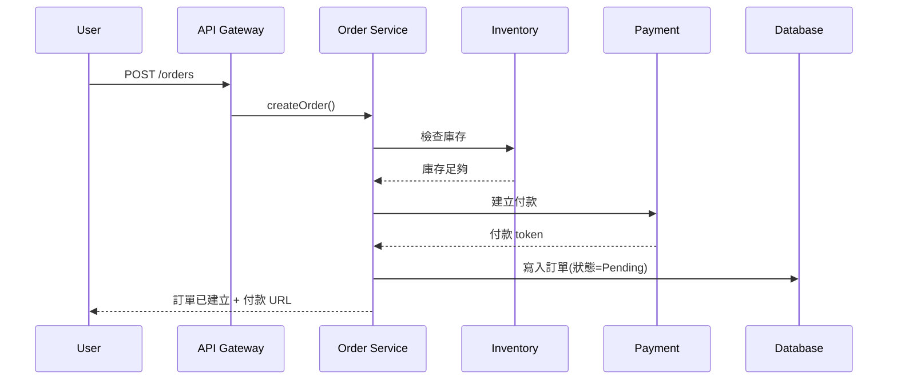

# 資料流文件(Data Flow)

> **目的**:描述資料從哪裡來、經過哪些處理、到哪裡去。
> **負責人**:技術 lead / 架構師
> **Review**:資深工程師

---

## 1. 高層次資料流總覽

> 一張圖看懂資料怎麼流動。

```
[使用者] → [API Gateway] → [Order Service] → [DB]
                                ↓
                          [Event Bus] → [Notification] → [Email/SMS]
                                ↓
                          [Inventory Service]
```

## 2. 主要流程(End-to-End Flow)

> 挑 3–5 個最重要的 use case,各畫一次循序圖。

### 2.1 流程:使用者下單



**關鍵點**
- 庫存只做檢查,不扣減(扣減在付款成功後)
- 訂單以 Pending 狀態建立,15 分鐘未付款自動取消
- 失敗情境:庫存不足 / 金流服務無回應 / DB 寫入失敗

### 2.2 流程:付款回呼
(同上)

### 2.3 流程:...

## 3. 資料同步與一致性

### 3.1 同步 vs 非同步
| 場景 | 方式 | 理由 |
|------|------|------|
| 下單檢查庫存 | 同步 | 使用者需要立即知道結果 |
| 出貨通知 | 非同步(事件) | 不影響主流程 |
| 報表彙整 | 批次(每日) | 量大、不需即時 |

### 3.2 一致性策略
- **強一致**:訂單與付款狀態
- **最終一致**:訂單與庫存(透過事件補償)
- **可容忍延遲**:報表、統計數據

## 4. 資料儲存層次

| 資料類型 | 儲存位置 | 保留期 | 備份策略 |
|---------|---------|--------|---------|
| 即時交易 | PostgreSQL | 永久 | 每日全備 + WAL |
| Session | Redis | 24h | 不備份 |
| 日誌 | S3 + Loki | 90 天 | 跨區複製 |
| 檔案上傳 | S3 | 永久 | 版本管理 |

## 5. 資料外流(Egress)

> 哪些資料會傳給外部系統?注意合規。
- 付款資訊 → 金流商(只傳必要欄位)
- 出貨資訊 → 物流商
- 分析事件 → GA / 內部 BI

## 6. 失敗情境與重試

| 情境 | 策略 |
|------|------|
| 第三方 API 超時 | 重試 3 次,exponential backoff |
| Event Bus 不可用 | 寫入本地 outbox,定期重送 |
| 部分失敗 | 補償交易(saga pattern) |
