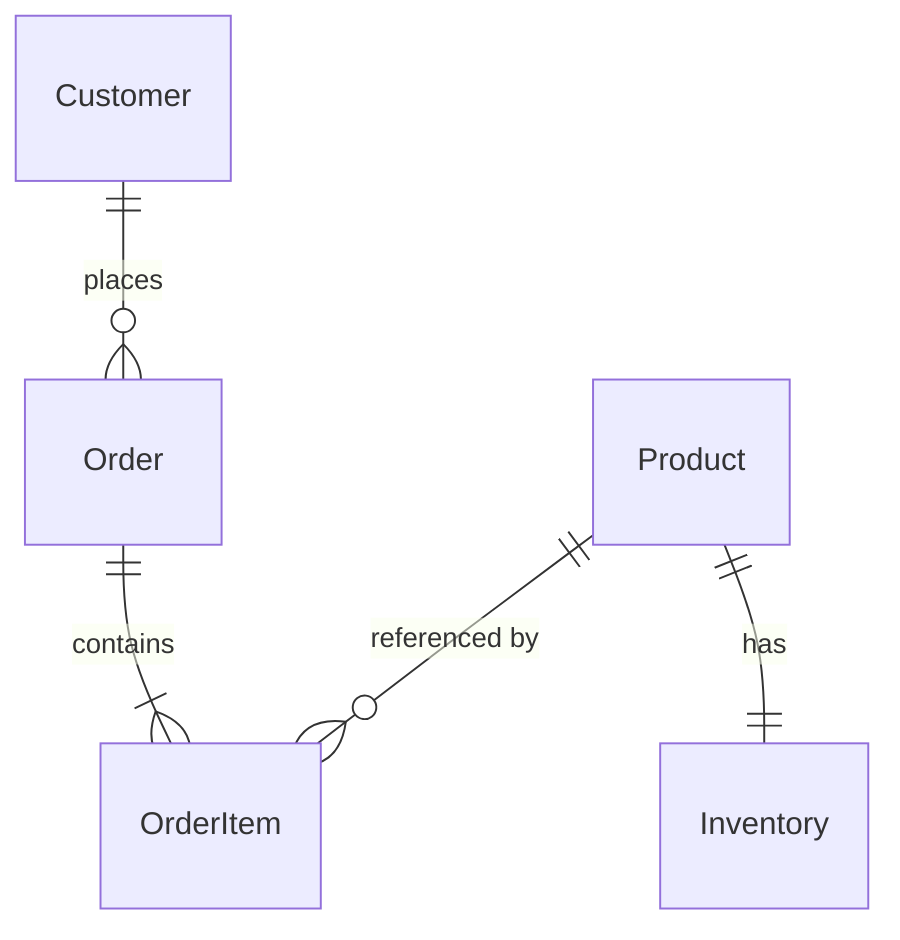

# 領域模型(Domain Model)

> **目的**:定義系統中的核心實體、它們之間的關係、以及業務規則。
> **負責人**:技術 lead / 架構師
> **Review**:資深工程師、PM(確認與需求對齊)

---

## 1. 核心概念(Glossary)

> 業務語彙統一,避免一個概念有十種講法。
> 這份 glossary 之後也是程式碼命名的依據。

| 術語 | 定義 | 範例 |
|------|------|------|
| 訂單(Order) | 一次完整的購買交易 | 客戶在 5/27 下的單號 #1234 |
| 訂單項目(OrderItem) | 訂單中的單一商品 | 訂單 #1234 中的「黑色 T 恤 x 2」 |
| 庫存(Inventory) | 商品的可售數量 | |

## 2. 實體(Entities)

### 2.1 Order(訂單)
- **職責**:代表一次購買行為
- **主要屬性**:id、客戶、狀態、總金額、建立時間
- **狀態機**:Draft → Submitted → Paid → Shipped → Completed / Cancelled
- **業務規則**:
  - 訂單一旦付款,不能修改項目
  - 取消必須在出貨前

### 2.2 OrderItem(訂單項目)
- **職責**:訂單中的單一商品紀錄
- **主要屬性**:商品、數量、單價、小計

### 2.3 ...

## 3. 實體關係圖(ER Diagram)

> 可用文字、Mermaid、PlantUML 或外部工具(draw.io、Lucidchart)繪製。

## 4. 業務規則(Business Rules)

> 跨實體的規則,不屬於單一實體。
1. 庫存不足時,訂單不能進入 Submitted 狀態
2. 同一客戶 24 小時內無法重複下單同一商品超過 3 次
3. ...

## 5. 邊界(Bounded Context)

> 若系統較大,可用 DDD 的 bounded context 切分。
> 不同 context 之間,同一個詞可能有不同意義(例如「客戶」在訂單模組 vs CRM 模組)。

- **訂單 Context**:Order、OrderItem、Payment
- **庫存 Context**:Product、Inventory、Warehouse
- **客戶 Context**:Customer、Profile、Address

## 6. 未來演進
> 哪些實體預期會擴展?哪些關係可能變?
