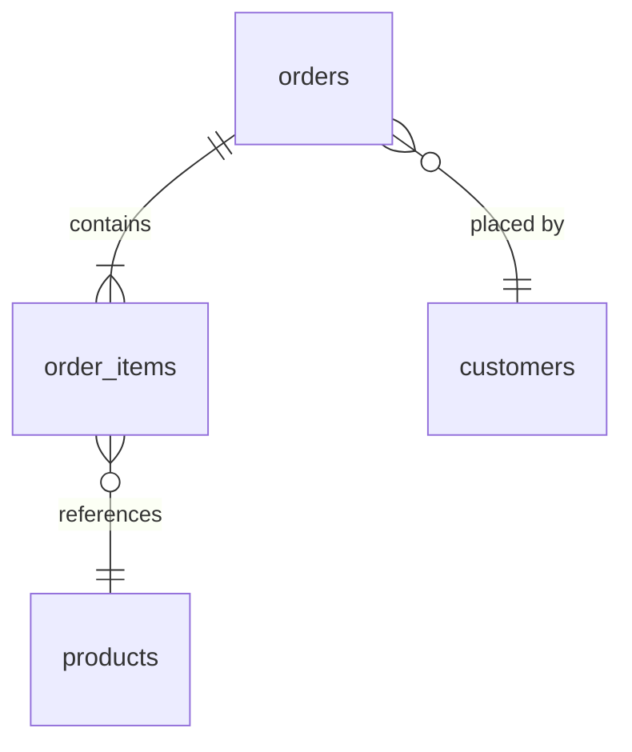

# 資料表設計(Data Schema)

> **目的**:定義資料表結構、欄位、索引、關聯、migration 策略。
> **負責人**:負責該模組的工程師
> **Review**:另一位工程師 + DBA(若有)

---

## 1. 設計原則
- 命名:snake_case、複數型表名(orders 而非 order)
- 主鍵:預設 UUID(避免猜測、利於分散式)
- 時間:統一 UTC、TIMESTAMPTZ
- 軟刪除 vs 硬刪除:預設軟刪除(deleted_at),例外註明
- 外鍵:預設加上,效能瓶頸再評估解除

## 2. 資料表清單

| 表名 | 用途 | 預估資料量 | 主要查詢模式 |
|------|------|-----------|-------------|
| orders | 訂單主檔 | 100 萬/年 | 依 customer_id、status、created_at |
| order_items | 訂單項目 | 500 萬/年 | 依 order_id |
| ... | | | |

## 3. 各表詳述

### 3.1 orders

| 欄位 | 型別 | Null | 預設 | 說明 |
|------|------|------|------|------|
| id | UUID | NOT NULL | gen_random_uuid() | 主鍵 |
| customer_id | UUID | NOT NULL | | FK → customers.id |
| status | VARCHAR(20) | NOT NULL | 'draft' | draft/submitted/paid/shipped/completed/cancelled |
| total_amount | DECIMAL(10,2) | NOT NULL | 0 | 訂單總額 |
| currency | CHAR(3) | NOT NULL | 'TWD' | ISO 4217 |
| created_at | TIMESTAMPTZ | NOT NULL | now() | |
| updated_at | TIMESTAMPTZ | NOT NULL | now() | 觸發器自動更新 |
| deleted_at | TIMESTAMPTZ | NULL | NULL | 軟刪除 |

**索引**
| 名稱 | 欄位 | 類型 | 用途 |
|------|------|------|------|
| pk_orders | id | PRIMARY | |
| idx_orders_customer | customer_id, created_at DESC | BTREE | 查客戶歷史訂單 |
| idx_orders_status | status | BTREE | 後台依狀態篩選 |

**約束**
- CHECK (total_amount >= 0)
- CHECK (status IN ('draft', 'submitted', 'paid', 'shipped', 'completed', 'cancelled'))

**觸發器 / 規則**
- updated_at 自動更新

### 3.2 order_items
(同上)

## 4. 關聯圖

## 5. 索引策略

### 5.1 預期慢查詢
| 查詢 | 索引 | 預估筆數 |
|------|------|---------|
| 客戶最近訂單 | idx_orders_customer | < 100 |
| 後台搜尋未付款 | idx_orders_status | 變動 |

### 5.2 避免的反模式
- 不在低基數欄位單獨建索引(如 boolean)
- 不過度索引(寫入會慢)

## 6. Migration 策略

### 6.1 工具
> 例:Flyway、Liquibase、Prisma Migrate、TypeORM migrations

### 6.2 規則
- 一次 migration 只做一件事
- 向後相容優先(先加欄位 → 部署 → 用新欄位 → 移除舊欄位)
- 大表變更要評估鎖表時間
- production migration 必須有 rollback 計畫

### 6.3 危險操作清單
- DROP COLUMN / TABLE:需 RFC
- 大表加索引:用 CONCURRENTLY
- 改欄位型別:分多步進行

## 7. 資料保留與封存
| 資料 | 線上保留 | 封存 | 銷毀 |
|------|---------|------|------|
| 訂單 | 3 年 | 7 年(冷儲存) | 法規允許後 |
| 日誌 | 90 天 | 1 年 | |

## 8. 個資與合規
- 哪些欄位是 PII(姓名、Email、電話、地址)
- 加密策略:傳輸 TLS、儲存欄位級加密(身分證、卡號)
- 存取稽核
