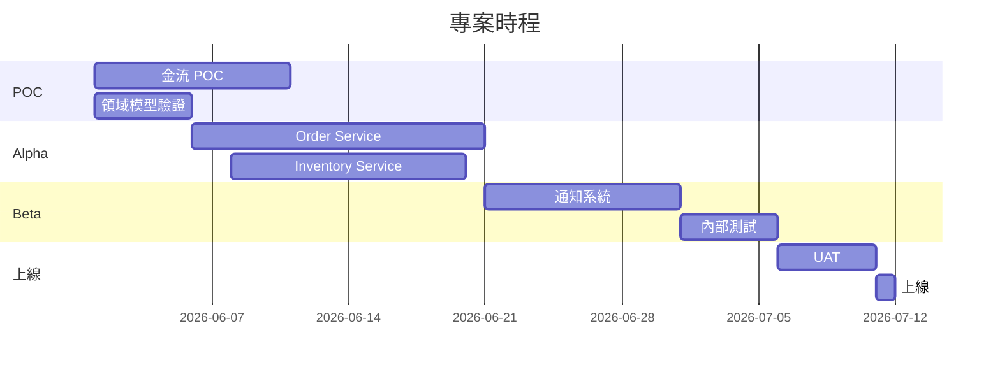

# 里程碑與時程(Milestones & Timeline)

> **目的**:把任務組織成里程碑,讓 stakeholder 對「什麼時候會看到什麼」有共識。
> **負責人**:PM + 技術 lead
> **Review**:Stakeholder
> **核心原則**:里程碑是「使用者能感受到的進展」,不是「程式碼寫到第幾行」。

---

## 1. 里程碑總覽

| 里程碑 | 目標日期 | 主要交付 | 對應任務 |
|--------|---------|---------|---------|
| M1: 技術 POC | W2 | 金流 POC、領域模型驗證 | PAY-001, ORD-001~002 |
| M2: 內部 Alpha | W6 | 核心下單流程可跑(內部測試) | ORD-001~005, INV-001~003 |
| M3: 封閉 Beta | W10 | 邀請 10 位使用者試用 | + 通知、報表 |
| M4: 公開上線 | W14 | 全量上線 | 完整功能、上線檢查清單 |
| M5: 上線後優化 | W18 | 依據監控與回饋調整 | - |

## 2. 各里程碑詳述

### M1:技術 POC
**目標**
- 驗證關鍵技術假設可行
- 排除最大風險

**範圍**
- 金流 POC(信用卡能扣款、能退款)
- 領域模型在實際資料上驗證

**驗收標準**
- [ ] 金流測試環境可完成一筆扣款 + 退款
- [ ] 領域模型 review 通過
- [ ] 已識別需要的調整,更新到設計文件

**不在此里程碑**
- 完整 UI
- 邊界情境處理

---

### M2:內部 Alpha
(同上格式)

### M3:封閉 Beta
...

## 3. Gantt / Roadmap 視覺化

## 4. 關鍵路徑(Critical Path)

> 哪條路徑決定整體時程?
- 金流 POC → Order Service → 通知 → UAT → 上線
- 任何延遲都會直接影響上線日

## 5. 緩衝(Buffer)

- 每個里程碑保留 15–20% 緩衝
- 整體再保留 1–2 週上線前 buffer
- **不要假設所有事都會順利**

## 6. 對外承諾的版本

> 對外溝通用的時程(stakeholder 看的),通常比內部時程保守。

| 對外里程碑 | 對外日期 | 內部目標 |
|----------|---------|---------|
| Beta 邀請 | 2026-08-15 | 2026-08-08 |
| 公開上線 | 2026-09-30 | 2026-09-15 |

## 7. 重新評估點(Checkpoint)

- 每個里程碑結束時 review 整體時程
- 若延遲 > 1 週,觸發 stakeholder 對齊會議
- 範圍可調整,日期可延,品質不妥協(三選二)

## 8. 變更紀錄

| 日期 | 變更 | 原因 |
|------|------|------|
| YYYY-MM-DD | M3 延後一週 | 金流 POC 發現需多處理風控 |
