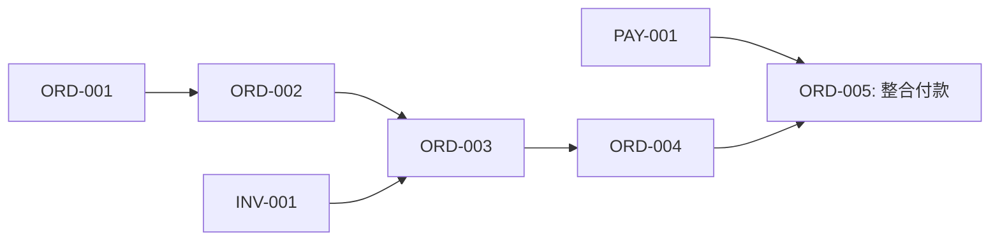

# 任務拆解(Task Breakdown)

> **目的**:把大功能拆成可獨立完成、可驗證的小任務,標出依賴與優先序。
> **負責人**:技術 lead + PM,實作者參與
> **Review**:PM、技術 lead、實作者共識
> **核心原則**:每個任務 1–2 天可完成。太大代表還沒拆夠細。

---

## 1. 任務命名與編號

- 編號:`[模組]-[流水號]`,例:`ORD-001`、`PAY-012`
- 標題:動詞開頭、具體可驗證
  - ✓ "Order Service: 建立 POST /orders 端點"
  - ✗ "處理訂單"(太模糊)

## 2. 完成定義(Definition of Done)

> 所有任務通用。寫程式只是一部分。

- [ ] 程式碼完成,通過 lint / format
- [ ] 單元測試完成且通過
- [ ] 必要的整合測試完成
- [ ] Code review 通過(至少 1 位)
- [ ] 文件更新(API spec / README / dev notes)
- [ ] Merge 到 main 並通過 CI
- [ ] 部署到 dev 環境驗證
- [ ] 對應的 use case 可端對端跑通

## 3. 任務清單

| ID | 標題 | 模組 | 估算 | 風險 | 依賴 | 負責人 | 狀態 |
|----|------|------|------|------|------|--------|------|
| ORD-001 | 設計 orders 資料表並建立 migration | Order | 1d | 低 | - | | Todo |
| ORD-002 | 實作 OrderRepository | Order | 1d | 低 | ORD-001 | | Todo |
| ORD-003 | 實作建立訂單業務邏輯 | Order | 2d | 中 | ORD-002, INV-001 | | Todo |
| ORD-004 | 建立 POST /orders 端點 | Order | 1d | 低 | ORD-003 | | Todo |
| INV-001 | Inventory Service: 庫存檢查 API | Inventory | 2d | 中 | - | | Todo |
| PAY-001 | 整合金流商 X(POC) | Payment | 3d | **高** | - | | Todo |
| ... | | | | | | | |

**估算單位**:理想人天(ideal day)。也可用 story point(S=1d、M=2d、L=3d、XL→拆)。

**風險標記**:
- 高:技術不熟、依賴外部、規格不明
- 中:有挑戰但可控
- 低:routine

## 4. 任務詳述

> 每個任務值得展開的可單獨寫卡,或在這份文件展開。

### ORD-003:實作建立訂單業務邏輯

**描述**
實作 OrderService.createOrder(),包含:
- 驗證輸入
- 呼叫 Inventory 檢查庫存
- 計算總額(含優惠券)
- 寫入 DB(狀態=draft)
- 發布 order.created 事件

**前置**
- ORD-002:OrderRepository
- INV-001:庫存檢查 API

**驗收標準**
- [ ] Happy path:成功建立訂單
- [ ] 庫存不足:回 INSUFFICIENT_STOCK
- [ ] 重複請求(idempotency key):回原訂單
- [ ] 單元測試覆蓋率 ≥ 80%

**風險與假設**
- 假設 Inventory API 回應 < 200ms
- 風險:優惠券計算規則尚未完全確認 → 待 PM 確認後實作

**估算**:2d

## 5. 依賴關係視覺化

## 6. 排序策略

**優先順序**(依序執行 / 排程):

1. **高風險先做**:PAY-001(金流 POC)、INV-001(庫存模型驗證)
2. **依賴最多的先做**:ORD-001、ORD-002(很多任務依賴它)
3. **能讓使用者最早拿到價值的**:最小可用流程(MVP)所需任務
4. **獨立可平行的**:分配給不同人

**反模式**:不要把簡單任務放前面只是為了「先看到進度」——高風險的東西拖到最後一旦炸掉,整個排程都要重排。

## 7. 並行規劃

| 週次 | 工程師 A | 工程師 B | 工程師 C |
|------|---------|---------|---------|
| W1 | PAY-001(POC) | ORD-001, ORD-002 | INV-001 |
| W2 | PAY-002 | ORD-003 | INV-002 |
| W3 | PAY-003 | ORD-004 | QA / 整合 |

## 8. 不在此次範圍

> 對應到需求文件的 Nice to Have,先記下不做。
- 訂單匯出 Excel
- 訂單批次操作

## 9. 變更紀錄

| 日期 | 變更 | 原因 |
|------|------|------|
| YYYY-MM-DD | 新增 ORD-006 | 需求補充 |
